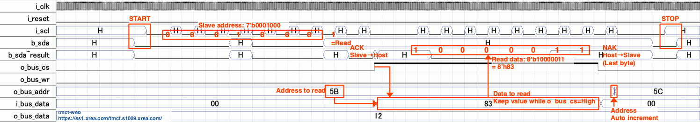
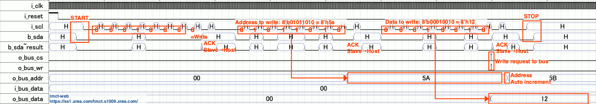
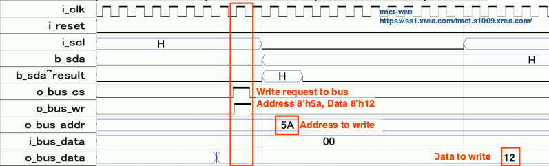

# i2c_slave_tmct
I2C slave (I2C to bus) module  
[日本語はこちら](#anchor0_ja)

i2c_slave_tmct is a basic I2C slave IP core that provides the basic framework for the implementation of custom I2C slave devices.  
The core provides a means to read and write up to 256 8-bit registers. These registers can be connected to the users custom logic, thus implementing a simple control and status interface.  
Please note that this module is distributed under the 3-article BSD license. You are free to use it as long as you do not violate the terms of use.

i2c_slave_tmct は、基本的なカスタムI2Cスレーブデバイスを実装するためのフレームワークIPコアです。  
8ビットのレジスタを最大256個まで読み書きする手段を提供します。これらのレジスタはユーザーのカスタムロジックに接続することができ、シンプルな制御およびステータスインタフェースを実装することができます。  
本モジュールは3条項BSDライセンスのもとに配布されます。利用条項に違反しない限り自由にご利用ください。  
※日本語の解説文は[英語の解説文の下](#anchor0_ja)にあります。

---
## Table Of Contents
- [File Organization](#anchor1_en)
- [Input/Output Signals](#anchor2_en)
- [Operation](#anchor3_en)
- [Resource Utilization](#anchor4_en)

## File Organization
i2c_slave_tmct is composed of the following file.  
The file names and the role of each file are shown below.

| File name | Details |
| :-- | :-- |
| i2c_slave.sv | The main body of the ip core module. This ip core consists of only one file. |

A sample implementation of a simple register using this module is included in the */sample* folder.

| File name | Details |
| :-- | :-- |
| sample/i2c_slave_sample_top.sv | This is the top module of the sample implementation. |
| sample/regs.sv | Example of register implementation. |

## Input/Output Signals
Details on the signals input and output for i2c_slave.sv are shown below.  

| Signal name | Direction (from/to this module) | Details |
| :-- | :-- | :-- |
| i_clk         | Input  | Operating clock input. At least i_scl frequency×10 is required. For example, if i_scl is 400 kHz, it must be at least 4 MHz. |
| i_reset       | Input  | Asynchronous reset input.(Active High) |
| i_scl     | Input  | Connect to the SCL signal of the I2C bus. (form the host system) |
| b_sda | InOut | Connect to the SDA signal of the I2C bus. This signal is bidirectional. |
| o_bus_cs       | Output | Chip select output to the internal bus system.(Active High) |
| o_bus_wr      | Output | Write strobe output to the internal bus system.(1 i_clk cycle pulse, Active High) |
| o_bus_addr[7:0] | Output  | Address output to the internal bus system. |
| i_bus_data[7:0] | Input  | Data input from the internal bus system. |
| o_bus_data[7:0] | Output | Data output to the internal bus system. |

The slave address can be set arbitrarily. Please refer to *sample/i2c_slave_top.sv* for how to set up.

## Operation
The core has 8bit address space(=up to 256 registers) that can be accessed via I2C.  
I2C write operations are used to set the register address pointer, and write the register data.  
I2C reads are used to read the register data.  
After a data read or write, the register address pointer is automatically incremented.  
There is no limit to the range over which the register address pointer is incremented, and it will return to 0 after 255.  
Some Write/Read examples are shown below.  
The following example assumes *DEVICE_ID = 7'b0001_000-*(= slave address 0x10).

### Set address pointer
Set register address pointer = 0x12:

| No. | Data | Rd/Wr | Description | Ack/Nak |
| :-- | :--  | :-- | :-- | :-- |
| 1   | STA  | -   | Start condition | - |
| 2   | 0x10 | Write | Slave address(Write) | Ack (to I2C host) |
| 3   | 0x12 | Write | Register address | Ack (to I2C host) |
| 4   | STO  | -   | Stop condition | - |

### Read operation
Read 4 bytes of data starting at register address 0x34:

| No. | Data | Rd/Wr | Description | Ack/Nak |
| :-- | :--  | :-- | :-- | :-- |
| 1   | STA  | -   | Start condition | - |
| 2   | 0x10 | Write | Slave address(Write) | Ack (to I2C host) |
| 3   | 0x34 | Write | Register address | Ack (to I2C host) |
| 4   | STO  | -   | Stop condition | - |
| 5   | STA  | -   | Start condition | - |
| 6   | 0x11 | Write | Slave address(Read) | Ack (to I2C host) |
| 7   | - | Read | Register read: address 0x34 | Ack (from I2C host) |
| 8   | - | Read | Register read: address 0x35 | Ack (from I2C host) |
| 9   | - | Read | Register read: address 0x36 | Ack (from I2C host) |
| 10  | - | Read | Register read: address 0x37 | Nak (from I2C host) The final byte MUST NOT return ACK. |
| 11  | STO  | -   | Stop condition | - |

The access protocol is no different from a typical I2C EEPROM, etc.  
It is important to note that the last byte of Read data at consecutive addresses MUST NOT return Ack.  
> If the host returns Ack, this module drives SDA with the next bit of data on the falling edge of SCK.  
> If that bit is 0, SDA is driven Low, so the host cannot issue a stop condition and the bus stalls.  
> If the bus stalls, output clock to SCK until SDA goes High, then issue a stop condition.

An example of signal timing waveforms during **Single byte read operation** is shown below.  

** During a read operation, i_bus_data[7:0] must be reflected according to o_bus_addr[7:0].

### Write operation
Write 4 bytes of data starting at register address 0x56:

| No. | Data | Rd/Wr | Description | Ack/Nak |
| :-- | :--  | :-- | :-- | :-- |
| 1   | STA  | -   | Start condition | - |
| 2   | 0x10 | Write | Slave address(Write) | Ack (to I2C host) |
| 3   | 0x56 | Write | Register address | Ack (to I2C host) |
| 4   | 0x11 | Write | Value to be written to the register address 0x56 | Ack (to I2C host) |
| 5   | 0x22 | Write | Value to be written to the register address 0x57 | Ack (to I2C host) |
| 6   | 0x33 | Write | Value to be written to the register address 0x58 | Ack (to I2C host) |
| 7   | 0x44 | Write | Value to be written to the register address 0x59 | Ack (to I2C host) |
| 8   | STO  | -   | Stop condition | - |

An example of signal timing waveforms during Single byte write operation is shown below. (The waveforms below are different from those during the above operations.)  

An enlarged view of the WRITE request section is shown below.  

## Resource Utilization
| Target device | Logic Elements/Macrocells | Memory bits |
| :-- | :-: | :-: |
| EP3C16F484C6 (Intel Cyclone III) | 127 | 0 |
| 5CEBA4F23C7 (Intel Cyclone V) | 51 | 0 |

---

## もくじ
- [ファイル構成](#anchor1_ja)
- [入出力信号](#anchor2_ja)
- [使い方](#anchor3_ja)
- [リソース消費量](#anchor4_ja)

## ファイル構成
i2c_slave_tmctは以下のファイルから構成されています。  
ファイル名と各ファイルの役割を以下に示します。

| File name | Details |
| :-- | :-- |
| i2c_slave.sv | IPコアモジュールの本体です。 このIPコアは1つのファイルのみで構成されています。 |

このモジュールを使った簡単なレジスタの実装例は */sample* フォルダにあります。

| File name | Details |
| :-- | :-- |
| sample/i2c_slave_sample_top.sv | 実装サンプルのトップモジュールです。 |
| sample/regs.sv | レジスタ実装例です。 |

## 入出力信号
i2c_slave.sv に入出力される信号の詳細は以下の通りです。

| 信号名 | このモジュールからの 入出力方向 | 詳細 |
| :-- | :-- | :-- |
| i_clk         | 入力  | メインクロック入力です。 最低でも i_scl 周波数の10倍は必要です。たとえば i_scl = 400KHz の場合、4MHz 以上のクロックを入力してください。 |
| i_reset       | 入力  | 非同期リセット入力です。(Active High) |
| i_scl     | 入力  | I2C ホストの SCL に接続してください。 |
| b_sda | 入出力 | I2C ホストの SDA に接続してください。この信号は双方向です。 |
| o_bus_cs       | 出力 | 内部バスに対するのチップセレクト出力です。(Active High) |
| o_bus_wr      | 出力 | 内部バスに対するライトストローブ信号出力です。(1 i_clk 期間のパルスで、Active High です) |
| o_bus_addr[7:0] | 出力  | 内部バスに対するアドレス出力です。 |
| i_bus_data[7:0] | 入力  | 内部バスからのデータ入力です。 |
| o_bus_data[7:0] | 出力 | 内部バスへのデータ出力です。 |

スレーブアドレスは自由に設定することができます。設定の方法は *sample/i2c_slave_top.sv* を参照してください。

## 使い方
このコアはI2Cからアクセス可能な 8bitアドレス空間(=最大256レジスタ) を持っています。  
I2Cからの書き込み操作によって、レジスタアドレスポインタやレジスタデータを書き込むことができます。  
I2Cからの読み込み操作によって、レジスタデータを読むことができます。  
書き込み・読み込み操作後、レジスタアドレスポインタは自動的にインクリメント(+1)されます。  
レジスタアドレスポインタのインクリメント範囲に制限はありませんが、255 を超えると 0 に戻ります。  
いくつかの書き込み・読み込み例を以下に示します。  
以下の例では、*DEVICE_ID = 7'b0001_000-*(= スレーブアドレス 0x10) としています。

### レジスタアドレスポインタへの書き込み操作
レジスタアドレスポインタを 0x12 にセットする場合の例：

| No. | Data | Rd/Wr | Description | Ack/Nak |
| :-- | :--  | :-- | :-- | :-- |
| 1   | STA  | -   | Start condition | - |
| 2   | 0x10 | Write | スレーブアドレス(Write) | Ack (to I2C host) |
| 3   | 0x12 | Write | レジスタアドレス | Ack (to I2C host) |
| 4   | STO  | -   | Stop condition | - |

### 読み込み操作
レジスタアドレス 0x34 から 4バイトのデータを読み込む例：

| No. | Data | Rd/Wr | Description | Ack/Nak |
| :-- | :--  | :-- | :-- | :-- |
| 1   | STA  | -   | Start condition | - |
| 2   | 0x10 | Write | スレーブアドレス(Write) | Ack (to I2C host) |
| 3   | 0x34 | Write | レジスタアドレス | Ack (to I2C host) |
| 4   | STO  | -   | Stop condition | - |
| 5   | STA  | -   | Start condition | - |
| 6   | 0x11 | Write | スレーブアドレス(Read) | Ack (to I2C host) |
| 7   | - | Read | レジスタ読み込み: アドレス 0x34 | Ack (from I2C host) |
| 8   | - | Read | レジスタ読み込み: アドレス 0x35 | Ack (from I2C host) |
| 9   | - | Read | レジスタ読み込み: アドレス 0x36 | Ack (from I2C host) |
| 10  | - | Read | レジスタ読み込み: アドレス 0x37 | Nak (from I2C host) |
| 11  | STO  | -   | Stop condition | - |

アクセスプロトコルは一般的なI2C EEPROM等と同じです。  
連続したアドレスの最後のバイトの読み出し時、**ホストはAckを返してはなりません。**    
> ホストがAckを返した場合、このモジュールはSCKの立下りエッジで次のビットのデータでSDAをドライブします。  
> このビットが 0 であれば SDA は Low にドライブされるため、ホストはストップコンディションを出すことができず、バスはストールします。  
> バスがストールした場合、SDA が High になるまで SCK にクロックを出力した後、ストップコンディションを発行してください。

1バイト読み込み操作中の信号タイミング波形の例を以下に示します。

** 読み出し時には o_bus_addr[7:0] に従ったレジスタのデータを i_bus_data[7:0] に出力しておく必要があります。

### 書き込み操作
レジスタアドレス 0x56 から 4バイトのデータを書き込む例：

| No. | Data | Rd/Wr | Description | Ack/Nak |
| :-- | :--  | :-- | :-- | :-- |
| 1   | STA  | -   | Start condition | - |
| 2   | 0x10 | Write | スレーブアドレス(Write) | Ack (to I2C host) |
| 3   | 0x56 | Write | レジスタアドレス | Ack (to I2C host) |
| 4   | 0x11 | Write | レジスタアドレス 0x56 に書き込むデータ | Ack (to I2C host) |
| 5   | 0x22 | Write | レジスタアドレス 0x57 に書き込むデータ | Ack (to I2C host) |
| 6   | 0x33 | Write | レジスタアドレス 0x58 に書き込むデータ | Ack (to I2C host) |
| 7   | 0x44 | Write | レジスタアドレス 0x59 に書き込むデータ | Ack (to I2C host) |
| 8   | STO  | -   | Stop condition | - |

1バイト書き込み操作中の信号タイミング波形の例を以下に示します。

書き込みストローブ部分の拡大図は以下の通りです。

## リソース消費量
| Target device | Logic Elements/Macrocells | Memory bits |
| :-- | :-: | :-: |
| EP3C16F484C6 (Intel Cyclone III) | 127 | 0 |
| 5CEBA4F23C7 (Intel Cyclone V) | 51 | 0 |

